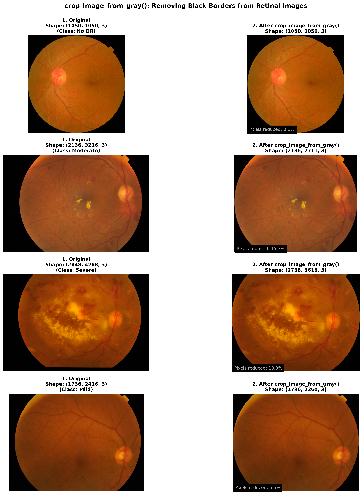
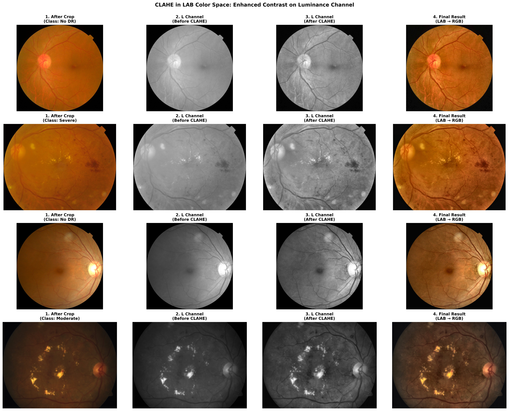
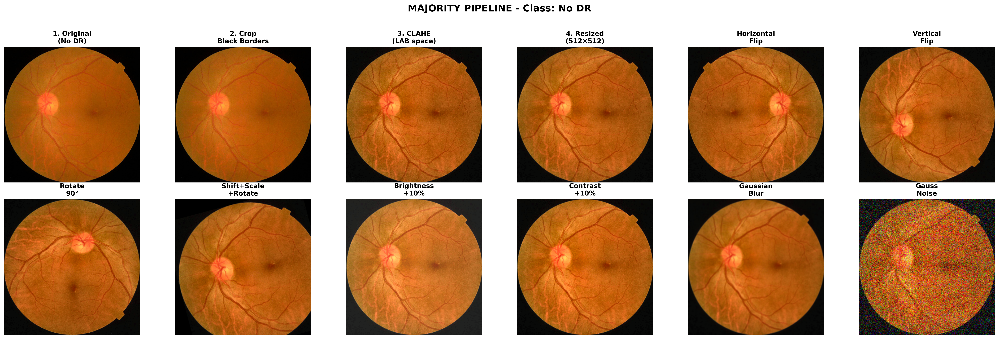
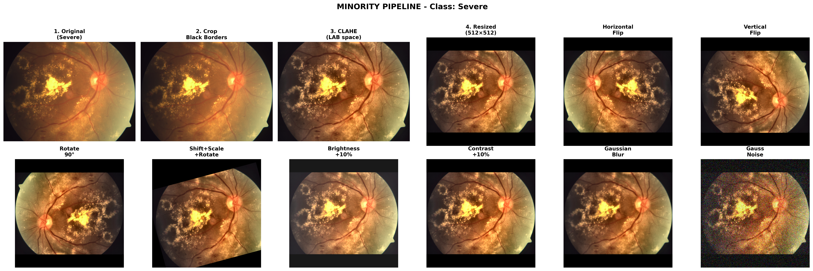
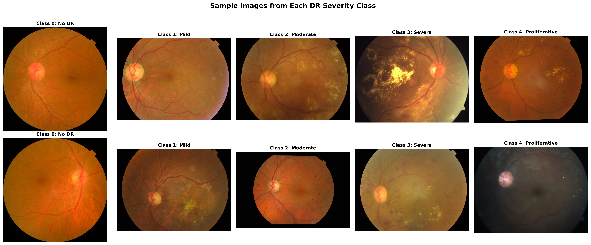
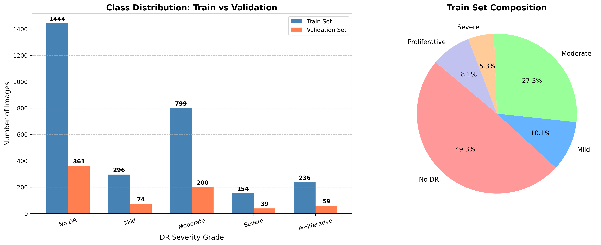
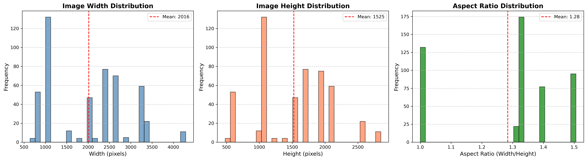
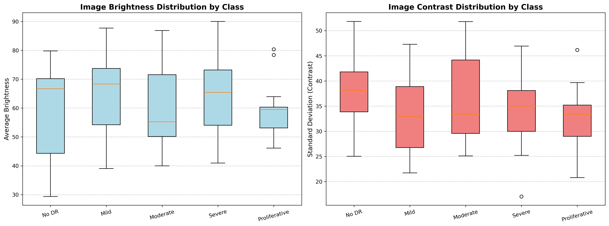
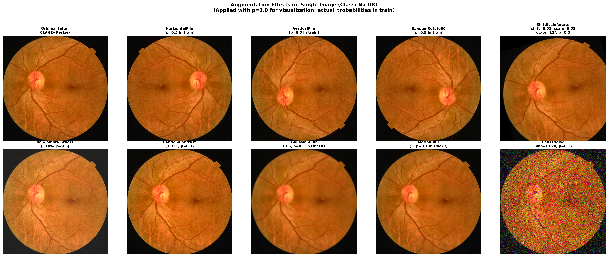

# Data Preparation

## Overview

The data preparation stage converts the raw retinal fundus images into a standardized representation suitable for deep learning while preserving clinically important anatomical structures.

Medical image preprocessing differs significantly from conventional computer vision pipelines. In retinal image analysis, excessive transformations may remove subtle pathological signs such as microaneurysms, hemorrhages, hard exudates, or vessel abnormalities. Therefore, every preprocessing operation in this project was carefully selected to enhance image quality without compromising diagnostic information.

The complete preprocessing pipeline consists of:

- Loading the APTOS dataset from either local Parquet files or the Hugging Face Hub.
- Automatic conversion of string labels into ordinal integer labels.
- Stratified train/validation splitting.
- Removal of black image borders.
- Contrast enhancement using CLAHE in the LAB color space.
- Anatomy-preserving image resizing.
- Medical-safe data augmentation.
- ImageNet normalization.
- Class imbalance mitigation using weighted sampling.

The following sections describe each stage in detail.

---

# Dataset Loading

The preprocessing pipeline supports two independent data sources.

- **Local Parquet files** (used during Windows development)
- **Hugging Face Dataset Hub** (used for Google Colab training)

This dual-loading mechanism allows the same training code to run without modification across different environments.

When running on Google Colab, the dataset is downloaded automatically from Hugging Face and cached locally to avoid repeated downloads in future sessions.

---

# Label Encoding

Different versions of the dataset store labels using different formats.

Some datasets use integer labels:

- 0 → No DR
- 1 → Mild
- 2 → Moderate
- 3 → Severe
- 4 → Proliferative DR

while others use descriptive string labels such as:

- no_diabetic_retinopathy
- mild_retinopathy
- moderate_retinopathy
- severe_retinopathy
- proliferative_retinopathy

To maintain complete compatibility across environments, the preprocessing pipeline automatically detects string labels and converts them into their corresponding ordinal integer representation.

This guarantees a consistent label space regardless of the dataset source.

---

# Stratified Train–Validation Split

Instead of performing a random split, the dataset is divided using **Stratified Sampling**.

An 80:20 train-validation split is created while preserving the original class distribution.

Maintaining identical class proportions is particularly important for diabetic retinopathy grading because the dataset is highly imbalanced and minority disease stages contain substantially fewer samples.

Without stratification, rare disease grades could become underrepresented inside the validation set, leading to unreliable performance estimates.

---

# Crop Black Borders

Fundus photographs frequently contain thick black borders surrounding the circular retinal region.

These pixels carry no diagnostic information and unnecessarily increase the amount of background processed by the neural network.

Before any preprocessing is applied, the pipeline automatically detects non-informative black regions using an intensity threshold and crops the image to the smallest bounding box containing retinal tissue.

This operation increases the effective retinal area seen by the model while preserving all anatomical structures.

  

---

# CLAHE Enhancement in LAB Color Space

Retinal images are often acquired using different fundus cameras, illumination conditions, and exposure settings.

These variations produce inconsistent brightness and local contrast that can reduce model robustness.

To address this issue, the preprocessing pipeline applies **Contrast Limited Adaptive Histogram Equalization (CLAHE)** to the luminance channel of the **LAB color space**.

Unlike applying CLAHE directly to RGB channels, enhancing only the L channel improves local contrast while preserving natural retinal colors.

This approach makes clinically relevant structures—including blood vessels, hemorrhages, microaneurysms, cotton wool spots, and exudates—more distinguishable without introducing unrealistic color artifacts.

  

---

# Preserving Retinal Geometry

Directly resizing retinal images to a fixed square resolution distorts anatomical structures.

Instead, this project preserves the original aspect ratio using a two-step resizing strategy:

- **LongestMaxSize**
- **PadIfNeeded**

First, the longest image dimension is resized to the target resolution.

Then, zero-padding is applied to obtain a final image size of **512 × 512 pixels**.

This approach preserves the natural geometry of retinal vessels, the optic disc, the macula, and pathological lesions while producing tensors with identical dimensions for batch processing.

---

# Data Augmentation

Deep learning models trained on medical datasets are highly susceptible to overfitting because annotated retinal datasets are relatively small compared to natural image datasets.

To improve generalization, anatomically safe augmentation techniques are applied during training.

The augmentation policy consists of two complementary groups of transformations.

## Geometric Transformations

Retinal orientation has no diagnostic meaning.

Therefore, controlled geometric augmentations are applied, including:

- Horizontal Flip
- Vertical Flip
- Random 90° Rotation
- Small Translation
- Mild Scaling
- Limited Rotation (±15°)

These operations increase orientation diversity while preserving anatomical consistency.

  

---

## Photometric Transformations

To simulate realistic acquisition variability, several conservative intensity-based augmentations are used.

These include:

- Random Brightness Adjustment
- Random Contrast Adjustment
- Mild Gaussian Blur
- Motion Blur
- Low-Variance Gaussian Noise

Unlike aggressive image corruption techniques, these transformations imitate real imaging conditions such as slight defocus, illumination changes, and sensor noise while maintaining lesion visibility.

  

Although the current implementation employs a unified augmentation pipeline for all training samples, the illustrated examples demonstrate how augmentation intensity can be adapted for majority and minority classes when stronger diversity is required to compensate for severe class imbalance.

---

# Anatomy-Aware Augmentation Design

Several commonly used computer vision augmentations were intentionally excluded from the training pipeline.

Examples include:

- GridDistortion
- ElasticTransform
- CoarseDropout
- Random Erasing

Although these operations often improve performance on natural image datasets, they may deform retinal vessels, remove tiny lesions, or generate anatomically implausible images.

Since diabetic retinopathy grading relies heavily on subtle pathological patterns, preserving retinal anatomy was prioritized over introducing aggressive image diversity.

---

# Class Imbalance Handling

The APTOS dataset exhibits a highly skewed class distribution, with the majority of images belonging to the No DR and Moderate DR categories.

Training directly on such data would bias the model toward majority classes and reduce sensitivity to severe disease stages.

To alleviate this problem, the training pipeline incorporates **Weighted Random Sampling**.

Sample weights are computed from class frequencies using Scikit-learn's `compute_class_weight()` function.

These weights are then assigned to individual training samples, allowing the sampler to generate more balanced mini-batches by increasing the sampling probability of minority classes.

Unlike simple oversampling, WeightedRandomSampler continuously produces different balanced batches without permanently duplicating images in the dataset.

---

# Image Normalization

After preprocessing and augmentation, every image is normalized using the standard ImageNet statistics:

- Mean = (0.485, 0.456, 0.406)
- Standard Deviation = (0.229, 0.224, 0.225)

Since EfficientNet is initialized using ImageNet pretrained weights, matching the original normalization distribution significantly stabilizes optimization, accelerates convergence, and improves transfer learning performance.

---

# Complete Data Preparation Pipeline

The complete preprocessing workflow can be summarized as follows:

1. Load dataset from Local Storage or Hugging Face.
2. Convert labels into ordinal integer classes when necessary.
3. Perform stratified train-validation splitting.
4. Remove non-informative black borders.
5. Apply CLAHE enhancement in the LAB color space.
6. Preserve aspect ratio using LongestMaxSize and PadIfNeeded.
7. Apply medically safe augmentations during training.
8. Normalize images using ImageNet statistics.
9. Generate balanced mini-batches using WeightedRandomSampler.

This pipeline standardizes retinal images while preserving anatomical fidelity, improving image quality, reducing acquisition variability, and mitigating class imbalance before the data are presented to the deep learning model.

---

# Visualizations

The figures below illustrate different stages of the data preparation pipeline.

### Sample Images

  

---

### Class Distribution

  

---

### Image Dimension Analysis

  

---

### Image Quality Analysis

  

---

### Augmentation Examples

  

